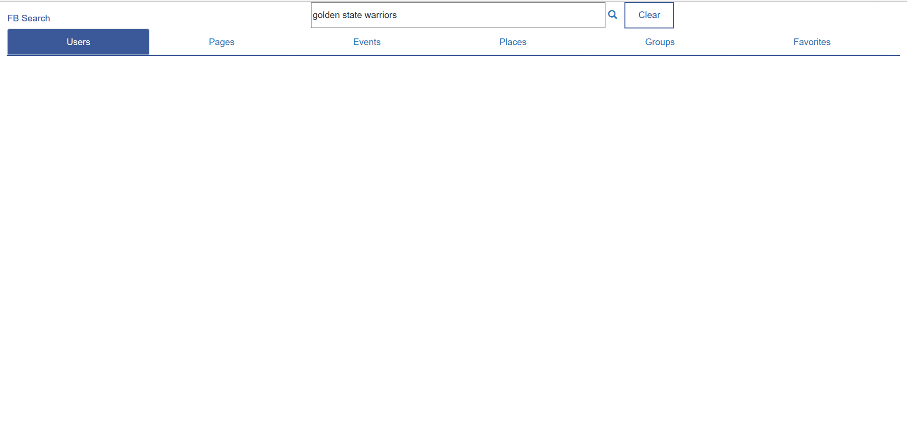
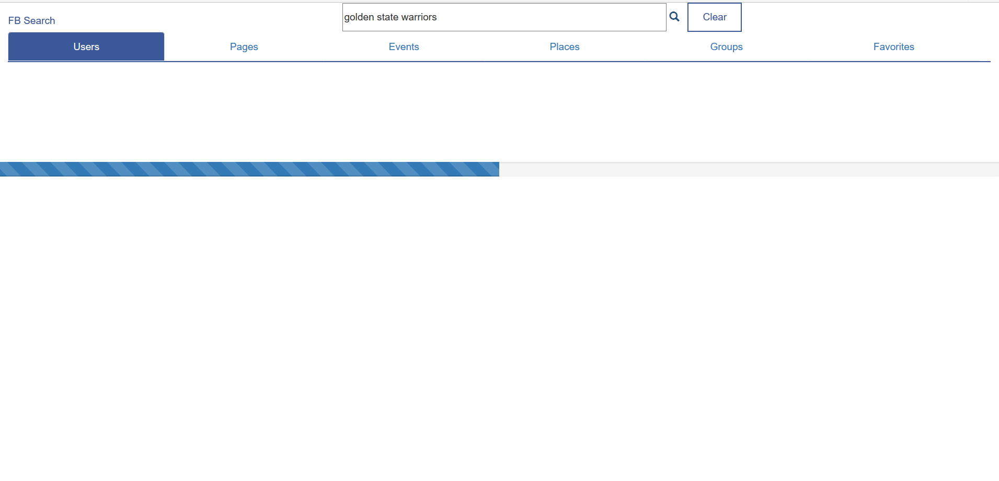
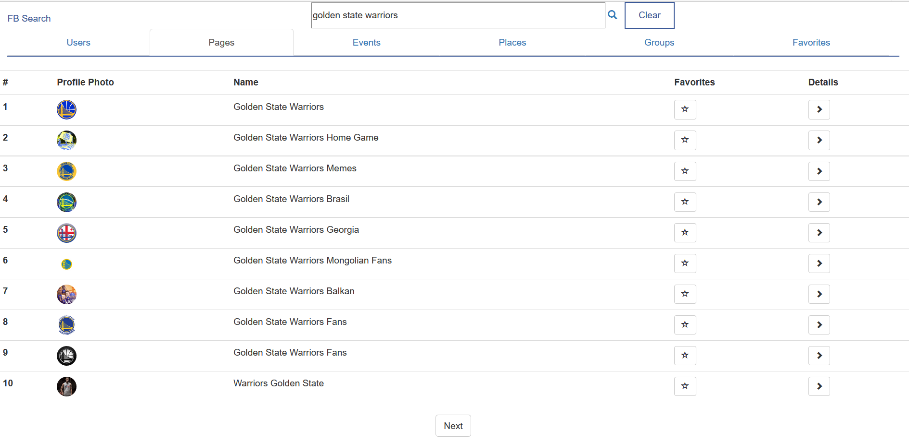
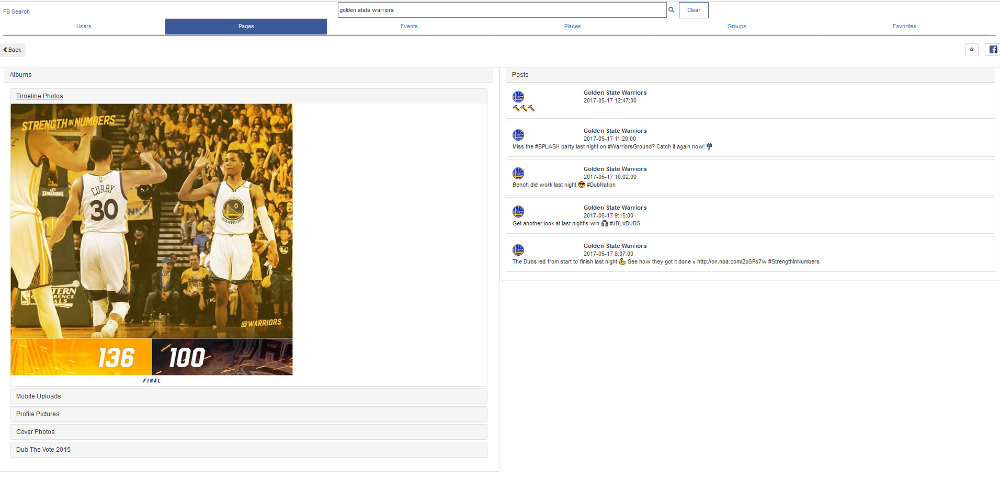
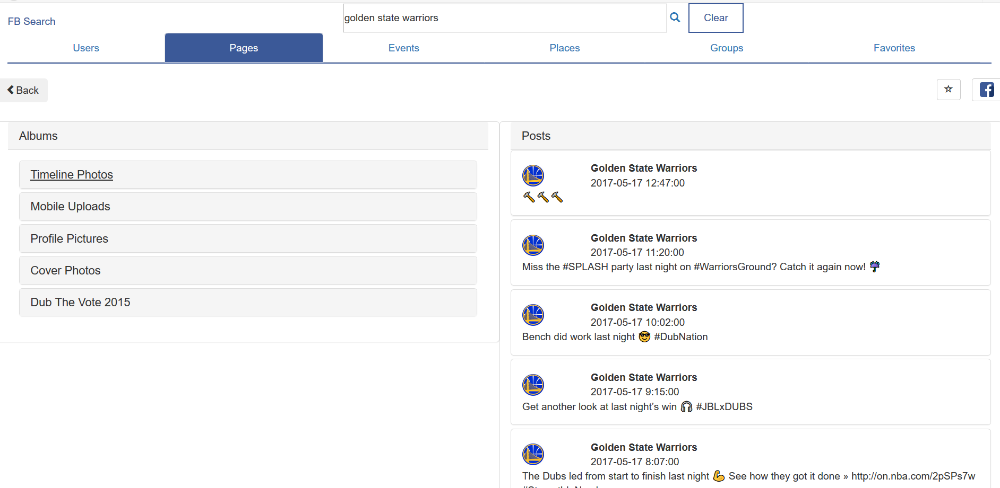

# Responsive Facebook Search
This is a responsive web application to retrieve a user’s search data from Facebook API and display the search results in a user-friendly UI. Queries can be submitted for users, pages, groups, events and places. The PHP script returns a JSON formatted data stream to the client, which is parsed and rendered to the UI. 

The page includes a navigation menu at the top and the users’ information table at the bottom. The page header includes a search bar, clear button, and a tabbed navigation bar for the different types of queries (users, pages, groups, events, and places). The search results are displayed in the information table below. An option for pagination is included to cap the search to 25 search results. An individual search result can then be clicked further to display the albums and photos for that particular search result. 

When a search query is submitted, the data is loaded using the AJAX component of AngularJS, which calls a PHP backend hosted on AWS. The PHP script sends a server request to the Facebook back-end, which returns a JSON response. The JSON response gets passed to the client to display the results.

There is also an option to store favorites, using localstorage. When an individual search result is starred, it is stored in the browser's localhost to save the result. 

## Details

### Web Application Front-End

#### AngularJS for functionality
- ng-click directive to toggle the JS functions to change tabs, gets the tab’s JSON response, and display that response
- An asynchronous GET request to server is used to retrieve the JSON
- ng-repeat directive to iterate through JSON responses to populate the response table

#### Bootstrap for UI
- container-fluid class to change how the navigation bar and table would look like in different view sizes 
- accordion id for expanding and collapsing the Albums and Posts
- Glyphicons for the search, favorite star, details buttons

### Back-End
From app, send GET request to PHP server script on AWS ElasticBeanstalk

#### PHP 
- Contains credentials to call Facebook Graph API
- Handle response encoding and decoding 
- Generates URL for a GET request to FB
- Retrieves JSON response and returns it to the web/mobile app 

### Handling Favorites and Sharing

#### Facebook Sharing
- Handled by a Facebook script

#### Favorites
- Web - HTML LocalStorage to track all entries that have been favorited / starred
- Mobile - Singleton Class

## Application Flow

